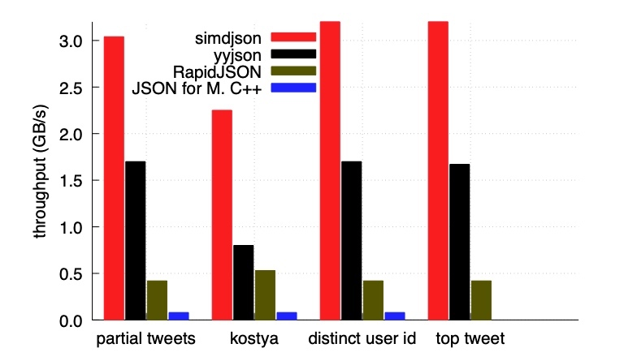
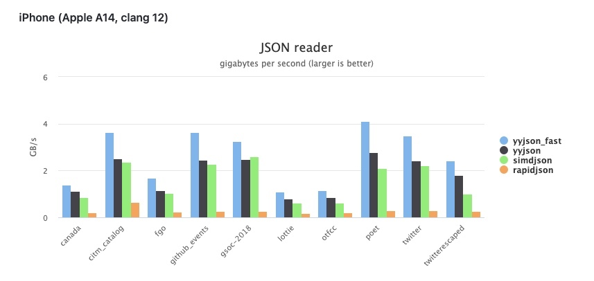
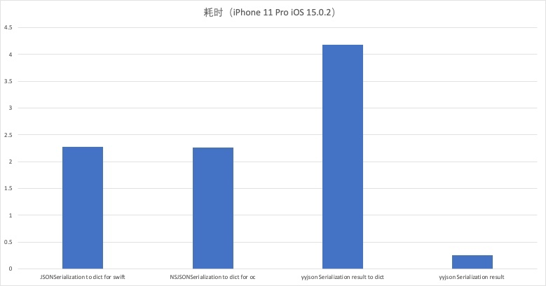
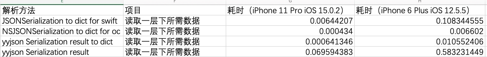
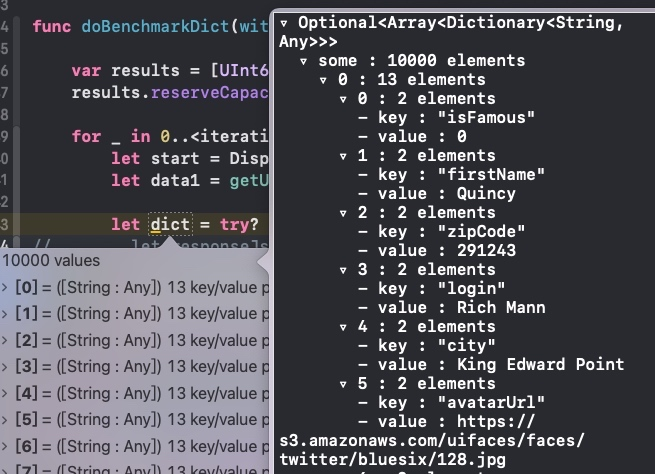
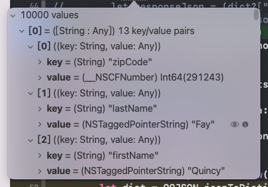

# Swift JSON To Dictionary 性能浅析

## 背景
在上一篇文章中，简单分析了Swift的JSON序列化和反序列化的性能，其中系统方法`JSONSerialization`转 Dictionary 的耗时很短，但在大型数据且嵌套很深的数据结构中，在后期取值会有所耗时，由于是混编项目，很怀疑是 OC 的字典转 Swift 字典耗时的问题，在转换的过程有性能损耗，且怀疑 Swift 版本`JSONSerialization`的结果也是NSDictionary 结构的，于是就有了这篇文章和其实践过程。

在探究过程分为了两大部分去看是否可以提升解析性能。其一探究是否有比iOS系统方法更快的解析手段，其二`JSONSerialization`解析后的结果每层解析是否有提升的空间，该部分会在最后讲到。

## 提高 JSON 解析性能方案
上一篇文章中有同学提供了另一个JSON TO Model 的方案 - [ZippyJSON](https://github.com/michaeleisel/ZippyJSON)，其核心是替换了解析JSON的库。将JSONSerialization的解析换成了另一种高效率的解析库 [simdjson](https://github.com/simdjson/simdjson)，通过调研发现其确实有解析速度的提升，其数据如下



看到这里感觉其速度是有很大的提升的，且对于图中提到的yyjson有一丝熟悉，感觉像是YYModel的作者的新库，其速度看着也有很大的提升。于是也去调研了一下，其确实是ibireme所写，也是对标simdjson的高性能跨平台的json解析库 - [yyjson](https://github.com/ibireme/yyjson) 且还是C语言实现的，官方也给出了性能数据，尤其是有iPhone平台的数据。



虽然双方的性能数据中，对方的都是比较差的，但 yyjson 有针对iPhone的A系列芯片的数据测试，让我感到可以有所提高iOS平台下JSON解析的性能提升。于是展开工作，看是否可以桥接到Swift开发中。下面都是将JSON数据转换成dictionary后到探究和讨论。

### 迁移替换Swift版本JSONSerialization
yyjson是C语言开发，且支持了Swift Package Manager，可以很好的迁移到Swift开发中，并且也可以将其 src下的文件拖到工程中，和普通混编项目一样直接引用就好。

具体的API调用可以看[yyjson的API文档](https://github.com/ibireme/yyjson/blob/master/doc/API.md)，这里就不过多进行解释，下面给出迁移好的代码。

```swift
import yyjson

private struct YYJsonType: OptionSet {
    let rawValue: UInt8
    init(rawValue: UInt8) {
        self.rawValue = rawValue
    }
    static let NONE = UInt8(0)        /* _____000 */
    static let NULL = UInt8(2)        /* _____010 */
    static let BOOL = UInt8(3)        /* _____011 */
    static let NUM = UInt8(4)        /* _____100 */
    static let STR = UInt8(5)        /* _____101 */
    static let ARR = UInt8(6)        /* _____110 */
    static let OBJ = UInt8(7)        /* _____111 */
}
private struct YYJsonSubType: OptionSet {
    let rawValue: UInt8
    init(rawValue: UInt8) {
        self.rawValue = rawValue
    }
    static let NONE = UInt8(0 << 3) /* ___00___ */
    static let FALSE = UInt8(0 << 3) /* ___00___ */
    static let TRUE = UInt8(1 << 3) /* ___01___ */
    static let UINT = UInt8(0 << 3) /* ___00___ */
    static let SINT = UInt8(1 << 3) /* ___01___ */
    static let REAL = UInt8(2 << 3) /* ___10___ */
}

private extension Data {

    func getBytes<T>() -> UnsafePointer<T>? {
        withUnsafeBytes { (ptr: UnsafeRawBufferPointer) in
            ptr.baseAddress?.assumingMemoryBound(to: T.self)
        }
    }
}

@objc public class YYJSONSerialization: NSObject {
    @objc public class func jsonObject(with data: Data, allowComments: Bool = false) -> Any? {
        let flags: UInt32 = allowComments ? YYJSON_READ_ALLOW_COMMENTS | YYJSON_READ_ALLOW_TRAILING_COMMAS : 0
        let doc = yyjson_read(data.getBytes(), data.count, flags)
        guard doc != nil else {
            return nil
        }
        defer {
            yyjson_doc_free(doc)
        }
        let root = yyjson_doc_get_root(doc)
        guard root != nil else {
            return nil
        }
        return yyjson(obj: root!)
    }

    private class func yyjson(obj: UnsafeMutablePointer<yyjson_val>) -> Any? {
        let type = yyjson_get_type(obj)
        let subType = yyjson_get_subtype(obj)

        if type == YYJsonType.NULL {
            return nil
        }

        if type == YYJsonType.STR {
            return String(cString: yyjson_get_str(obj))
        }

        if type == YYJsonType.BOOL {
            return subType & YYJsonSubType.TRUE > 0 ? true : false
        }

        if type == YYJsonType.NUM {
            if subType & YYJsonSubType.REAL > 0 {
                return yyjson_get_real(obj)
            }

            return subType & YYJsonSubType.SINT > 0 ? yyjson_get_sint(obj) : yyjson_get_uint(obj)
        }

        if type == YYJsonType.ARR {
            var array = [Any]()
            var iter = yyjson_arr_iter()

            yyjson_arr_iter_init(obj, &iter)
            while let val = yyjson_arr_iter_next(&iter) {
                if let obj = yyjson(obj: val) {
                    array.append(obj)
                }
            }
            return array
        }

        var dictionary = [String: Any]()

        var iter = yyjson_obj_iter()
        yyjson_obj_iter_init(obj, &iter)

        while let key = yyjson_obj_iter_next(&iter) {
            let val = yyjson_obj_iter_get_val(key)
            let keyStr = String(cString: yyjson_get_str(key))
            if let obj = yyjson(obj: val!) {
                dictionary[keyStr] = obj
            }
        }

        return dictionary
    }
}

```
其核心就是将 `json` data 转为c的char类型，进行解析。然后转化为其自己的JSON基本类型` NULL`、`BOOL`、`NUM`、`STR`、`ARR`、`OBJ`，其`OBJ`类似于iOS下的Dictionary，`NONE`作为不能识别的一项单独处理。然后根据顶层的Array或OBJ的类型进行递归遍历，将其变为Swift下的基本类型。

### 测试数据
准备工作准备好了就进行一波数据测试吧，于是将工作环境下的一个大约300kb的JSON打包到工程中进行测试。测试的过程都是进行了10次数据取的平均值，分为了高端机和低端机两大类。测试项分为四项
- JSONSerialization to dict for swift。 swift下JSONSerialization解析和读取一层的数据源。
- NSJSONSerialization to dict for oc。 OC下NSJSONSerialization解析和读取一层的数据源。
- yyjson Serialization result to dict。 yyjson 下解析 JSON 转为Swift字典后读取一层数据源。
- yyjson Serialization result。 yyjson下解析json为其原生数据类型后读取一层数据源。



根据数据来看`yyjson`转为Swift dictionary后是比较耗时的，尤其是工程中这种层层嵌套很多的JSON简直是灾难级别的，针对高端机，额外错了一次实验，针对嵌套的字典类型，只做了一次取值，没有进行构造新的字典后其耗时也大大下降，达到比原生更快的水准，这样更加可以确定是在嵌套构造字典时候是非常慢的。后进行一次单独的读取字典相关值的操作的耗时分析。如下
（由于数值很小，直接列出表格）



在解析后变为yyjson持有的类型耗时却大大的减少了，考虑到其还是C语言类型，在使用中会有不便，在测试过程中，通过XCTestCase进行了内存的测试，原生下Swift和OC的解析过程消耗内存持平，且最低，yyjson 解析为自有类型的内存消耗比原生高一点，yyjson to dict内存消耗最高。因此在工程中不会考虑这个方案。

此外对于转为swift的dictionary后整体耗时增加了，但其再度取值时，会比原生转为字典的方法快一些，因为后者解析后整体是个Any类型，里面的每个阶段的类型都没有明确，每次取值都比前者快（这里会在下面说到）。

总体是否可以持平，这一点无法去验证，因为实际工程链路负责，每一处进行取值赋值的地方很多，没有办法去做完整的测试，加上内部封装好的网络请求回来的就是 OC 下的 NSDictionary 类型，因此无法落地进行总链路的性能测试。

## 为什么JSONSerialization解析的字典在每层解析都需要耗时
首先了解一下 JSONSerialization，这里可以看一下官方的解释，这里也能说明为什么怀疑 Swift 版本`JSONSerialization`的结果也是NSDictionary 结构的。

> JSONSerialization 能将JSON 转化成Foundation 对象，也能将Foundation对象转换生JSON。但是转换的前提条件是：
> - 顶层对象必须是 Array & Dictionary 。
> - 所有的对象必须是NSString,NSNumber,NSArray,NSDictionary, or NSNull 中的一个。
> - 所有Dictionary的key必须是 String。
> - NSNumber 对象不能是非数值和无穷值。

根据官方的文档，无论是OC还是Swift的都是如上的解释，且根据实践可看到其解析出来就是如上所说的基本类型对象。如图




可以看出来，每一层的value都是NS类型对象，且都是对应类型的类簇。如NSString下两个类簇 NSTaggedPointerString 和 __NSCFString。

NSTaggedPointerString 是伪对象，直接将字符串存在指针的地址里，所以可以直接从地址读取字符串，例如 0xa000000000031312，31是'1'的十六进制的ASCII码，字符串长度为2，关于 NSTaggedPointerString 想深入了解可以去看看： [iOS开发-深入理解Tagged Pointer](https://blog.csdn.net/qq_36557133/article/details/100189584)。

__NSCFString 根据引用计数可以指定是存放在堆上的，也就是需要我们进行内存管理的对象，根据以上测试来看是优先级最低的类簇，这可能是为了减少数据小却消耗大内存的内存浪费现象，以及提高运算速率。

> 注：当字符串中包含ASCII码无法表示的字符时，不会以NSTaggedPointerString来存储字符串，例如中文。

通过查阅资料发现 NSString 以及 NSMutableString 都是由 NSPlaceholderString、NSPlaceholderMutableString、__NSCFConstantString、NSTaggedPointerString、__NSCFString 类簇组成的抽象类。有如下特点。
- NSPlaceholderString 和 NSPlaceholderMutableString 只在分配内存时过渡使用，只能调用初始化方法。
- __NSCFConstantString 是字符串常量，存储在常量区。
- NSTaggedPointerString 是伪对象，使用指针地址作为存储，可以存储长度≤11的字符串，ASCII码无法表示的字符无法使用。
- __NSCFString 存储在堆上。

对于的 NSDictionary 和 NSArray 也有对应的类簇，其相关特点也和上述的类似，这里就不深究了。

有了如上的知识点和实践结果，不难看出JSONSerialization最终还是解释成了 NS 类型对象及其类簇，而不是值类型。原因很简单，是为了极大的提高运算解析的速率和降低内存消耗。

且在解析后的JSON数据中，大多是字典或者数组，由于Swift值类型的写时拷贝等特性，在数组或者字典中存储非常多的东西后，还要对其中的内容进行添加或者删除。在这时，Swift 内建的值类型的容器类型在每次操作时都需要复制一遍，即使是存储的都是引用类型，在复制时我们还是需要存储大量的引用，这个开销就变得不容忽视了。因此复用NS对象类型的操作是最好的，将解析好的数据存储成对应的对象类型下的类簇或者本身对象类型，可以极大的提高解析速度和降低内存的消耗。

因此，JSONSerialization 在 Swift 版本解析后，本质上还是由引用对象层层嵌套的出来的结果，且每个 Key 的类型可以马上由 NSString 转换为 String，其对应的Value就是对象和其类簇，当我们取某一层数据时候都会将其转化为 `[String: Any]` 当其value在转换为Swift的Any时，就可以大抵推断出类型，这个过程就是需要消耗转换为准确的类型的时间。所以这就是在每层取值都会消耗一段时间的原因。

## 如何提高性能
那么有了如上的结论，基本上把创造一个比JSONSerialization更优秀的路子封死了，不得不说 Apple 的设计方案和优化还是很好的。在iOS的平台上不管是哪些通用的三方JSON to Model都是基于JSONSerialization去做的，耗时和内存都会比其增加，考虑到后续的扩展性JSONSerialization直接解析后的Dictionary和Array是最优解了。

那么如何提高使用时的性能呢？有几点小tips可以参考。
- 在需要处理大量数据并且频繁操作 (增减) 其中元素时，选择 NSMutableArray 和 NSMutableDictionary 会更好，而对于容器内条目小而容器本身数目多的情况，应该使用 Swift 语言内建的 Array 和 Dictionary。且对于一个数组里存放引用类型且类型是明确的时可以使用ContiguousArray。
- 在对JSON to Dictionary 的结果进行类型转换的时候，建议转换成`[String: Any]`而不是`[AnyHashable: Any]`。objc 下无泛型的 NSDictionary 到了Swift下 key是 Any，且key必须有hash值，但Any 未必有hash，因此诞生了`AnyHashable`。而`AnyHashable is struct`遵循`Hashable protocol`，在解析后的JSON Dictionary 是不会有无泛型的 NSDictionary的，上述也说到了其Key必定是String。这样可以避免性能损耗的。
- 如果想更加节省耗时，可以将某一层取出直接 as 成 `NSDictionary`
- 同一层下，有多个值，建议将上层的取出来作为持有。如下
```swift
let responseJson = (dict?["data"] as? [String: Any])?["response"] as? [String: Any]
let dataJson = responseJson?["data"] as? [String: Any]
let value1 = dataJson?["value1"]
let value2 = dataJson?["value2"]
// 而不是
let value1 = (((dict?["data"] as? [String: Any])?["response"] as? [String: Any])?["data"] as? [String: Any])?["value1"]
let value2 = (((dict?["data"] as? [String: Any])?["response"] as? [String: Any])?["data"] as? [String: Any])?["value2"]
```

## 总结
无论是OC版本的`NSJSONSerialization`还是Swift版本的`JSONSerialization`解析的耗时和内存都是最少的，其解析出的依然是引用类型的JSON对象，可以随意转换为需要的值类型。但为了更好的性能，可只将我们所需要的那一层转为Swift的值类型，其他的还是使用引用类型最省时间。

存在一些解析方案比苹果原生还要快的方案，但不实用在iOS平台，这在内存和上比原生消耗更大，因此不建议使用。

JSON解析出来Key都是String类型，在转为Swift Dictionary时，建议转为`[String: Any]`或者使用引用类型`NSDictionary`

NSDictionary 实际上对应的是Swift的`[AnyHashable: Any]`，但在Key转换成`AnyHashable`也会耗时，如果确定Key是String类型，就要参考上一条建议。

## 参考文章
[Swift 值类型和引用类型深度对比](https://juejin.cn/post/6844904000794394637)

[[iOS开发]NSString的三种类型管理方式](https://blog.csdn.net/m0_46110288/article/details/117332127?spm=1001.2101.3001.6650.2&utm_medium=distribute.pc_relevant.none-task-blog-2%7Edefault%7ECTRLIST%7ERate-2.pc_relevant_default&depth_1-utm_source=distribute.pc_relevant.none-task-blog-2%7Edefault%7ECTRLIST%7ERate-2.pc_relevant_default&utm_relevant_index=5)

[Swift JSONSerialization 源码](https://github.com/apple/swift/blob/main/lib/Basic/JSONSerialization.cpp)

[Swift底层进阶--020：Dictionary源码解析](https://www.jianshu.com/p/9f674fd1b27f)

> Swift 引入了 ContiguousArray，其设计的初衷是为了减少 Objc 桥接工作的负担。Swift.Array 底层存放的 _ArrayBuffer 承载了需要桥接到 NSArray 的功能，所以增加了一些类型检查的操作。而 ContiousArray 底层的 _ContiguousArrayBuffer 删除了桥接相关的代码。因此在不需要将数组桥接到 NSArray 或传递给 Objective-C API 的场景下，使用 ContiguousArray 可能比 Array 更有效，并且具有更可预测的性能。概括来说：Swift 中需要暴露给OC使用的数组，选择NSArray。如果需要引用属性，可以选择ContiguousArray（元素为引用类型），否则选用Array。
