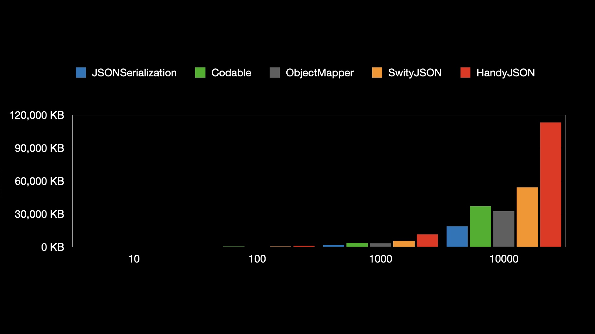
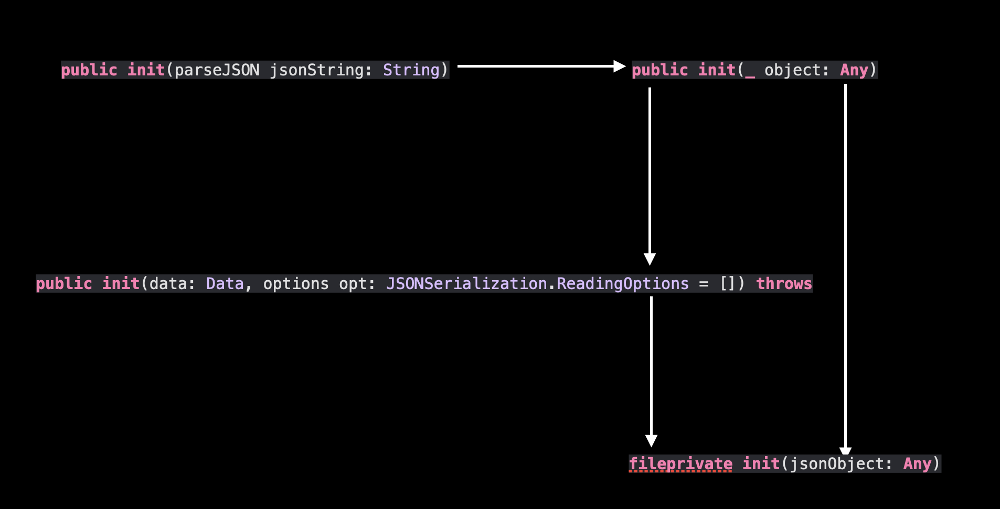
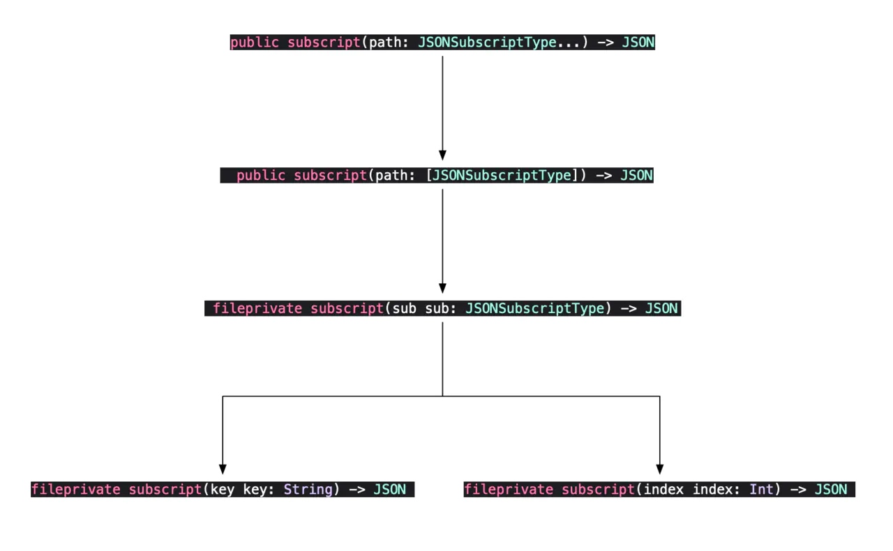
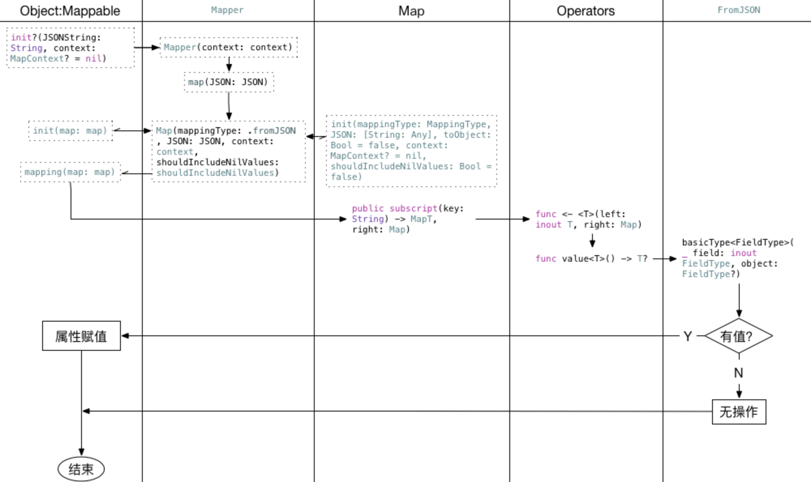

# Swift 中 JSON 序列化和反序列化方案性能分析

在开发中，在数据驱动视图的方式下，对 JSON 序列化和反序列化要求逐渐上升。因此在 Swift 开发中我们对 JSON 数据的处理只有两大需求：
- JSON 和 model 互转
- 对空值和关键数据类型的处理（Optional 类型和Bool类型）

由此解析 JSON 前有两个方向。
- 保持 JSON 语义, 直接解析 JSON。JSONSerialization 就是这样的。本质上仍然需要根据 JSON 结构去取值。对应可规避 Optional 和类型不对的问题。

- 自定义 Model 类, 将 JSON 反序列化类的实例, 再使用这些实例。ObjectMapper, Codable, 以及 HandyJSON 做的都是将 JSON 反序列化到 Model 类上。可以完整的进行互转，但需要大量代码进行类型与空值容错处理。

在这里两个方向上，`SwiftyJSON` 比较独特，它也保持了 JSON 语义，却以自己独有的 `JSON` 结构体去构造解析好的数据，存储 `key-value`，在通过其下标取值时，对`value`数据类型做判断，再与取值的类型进行容错包装进行抛出，类似实现了具有基本类型的取值安全的字典。其具体的分析可以往下看。

## 主流方案
- [SwiftyJSON](https://github.com/SwiftyJSON/SwiftyJSON) 只是将 json字符串转成自定义 JSON 结构，然后进行取值的包装，并不能完整转 model。
- [ObjectMapper](https://github.com/tristanhimmelman/ObjectMapper) 协议化的方法，需要对 model 中类型做一一对应的映射关系。大型 model 的灾难现场。
- [HandyJSON](https://github.com/alibaba/HandyJSON/tree/master) 采用反射和内存赋值来构造 Model。
- [Codable](https://developer.apple.com/documentation/swift/codable) 官方提供，作为语言层面对模型解析的支持方案，有其自身的优势。

除了上述4个方案，其实还有一个最原始的方案 —— JSONSerialization。JSONSerialization和SwiftyJSON两者类似都是将json原数据转成特定类型（前者 Dictionary，后者JSON），只都可惜不能完美转成model。但JSONSerialization 是 Apple 从iOS 5 开始就支持的方案，性能优化是最好。下面就对上述方法进行一下测试。


## 是骡子是马牵出来溜溜 
先来看一段 JSON 数据

```json
 [{
  "name": "Anaa Airport",
  "iata": "AAA",
  "icao": "NTGA",
  "coordinates": [-145.51222222222222, -17.348888888888887],
  "runways": [{
              "direction": "14L/32R",
              "distance": 1502,
              "surface": "flexible"
              }]
  }
]
```
这一段数据比较简单，解析难度也比较低，但如果是几千个或者上万个呢？让我们进行一下测试。

其中JSONSerialization和SwiftyJSON虽然不能完整支持转model，但可以定义对应的结构体的初始化器进行转换。代码如下

```swift
// SwiftyJSON
public struct AirportJSON {
    var name: String?
    var iata: String?
    var icao: String?
    var coordinates: [Double]?
    var runways: [RunwayJSON]?

    public init(jsonData: JSON) {
        name = jsonData["name"].string
        iata = jsonData["iata"].string
        icao = jsonData["icao"].string
        coordinates = jsonData["coordinates"].arrayObject as? [Double]
        let runwaysArray = jsonData["runways"].array ?? []
        runways = runwaysArray.map { RunwayJSON(jsonDate: $0) }
    }
    
    public struct RunwayJSON {
        enum Surface: String {
            case rigid, flexible, gravel, sealed, unpaved, other
        }
        
        public init(jsonDate: JSON) {
            direction = jsonDate["direction"].string
            distance = jsonDate["distance"].int
            let surfaceRawValue = jsonDate["surface"].string
            surface = Surface(rawValue: surfaceRawValue ?? "other")
        }
        var direction: String?
        var distance: Int?
        var surface: Surface?

    }
}
```

```swift
// JSONSerialization Dictionary 转 model
extension Airport {
    public init(json: [String: Any]) {
        guard let name = json["name"] as? String,
            let iata = json["iata"] as? String,
            let icao = json["icao"] as? String,
            let coordinates = json["coordinates"] as? [Double],
            let runways = json["runways"] as? [[String: Any]]
        else {
            fatalError("Cannot initialize Airport from JSON")
        }
        
        self.name = name
        self.iata = iata
        self.icao = icao
        self.coordinates = coordinates
        self.runways = runways.map { Runway(json: $0) }
    }
}

extension Airport.Runway {
    public init(json: [String: Any]) {
        guard let direction = json["direction"] as? String,
            let distance = json["distance"] as? Int,
            let surfaceRawValue = json["surface"] as? String,
            let surface = Surface(rawValue: surfaceRawValue)
            else {
                fatalError("Cannot initialize Runway from JSON")
        }
        
        self.direction = direction
        self.distance = distance
        self.surface = surface
    }
}
```
具体相关代码可以查看 [JSONPerformance](ttps://github.com/liyafly/JSONPerformance/) 。
下面是在 8核 i9 64g内存的 mbp16 上用 Xcode 12.5 swift 5.4 模拟器为 iPhone 12 Pro Max 的编译环境下的数据。


10次平均耗时统计




10次平均内存分配统计

可以看出来 JSONSerialization 和 Codable 综合性能比较好，总的来看耗时和内存分配是前者遥遥领先。看到这里，我悟了，大道至简，抛弃一切转 model 协议的 JSONSerialization 是最牛的。那么为什么添加了很许多语法糖，提供便利的方法来服务程序员的流行框架会那么耗时和内存呢？接下来就简单的分析一下。

## 源码浅析
### Codable 
先看官方定义 `typealias Codable = Decodable & Encodable`。顾名思义，Codable是解析器和编码器的集合，这样就是可以将数据序列化和反序列化。

我们只需要用JSONDecoder 和 JSONEncoder，就可以完成我们想要的结果，但是 JSONDecoder 并不是遵守 Decodable 协议，实际遵循 `Decoder` 的是 `_JSONDecoder` 这一个私有类，并且只会在每次调用 decode 的方法时，才会生成一个 `_JSONDecoder` 的实例去解析

```swift
open func decode<T : Decodable>(_ type: T.Type, from data: Data) throws -> T {
    let topLevel: Any
    do {
       topLevel = try JSONSerialization.jsonObject(with: data)
    } catch {
        throw DecodingError.dataCorrupted(DecodingError.Context(codingPath: [], debugDescription: "The given data was not valid JSON.", underlyingError: error))
    }

    let decoder = _JSONDecoder(referencing: topLevel, options: self.options)
    guard let value = try decoder.unbox(topLevel, as: type) else {
        throw DecodingError.valueNotFound(type, DecodingError.Context( codingPath: [], debugDescription: "The given data did not contain a top-level value."))
    }

    return value
}
```

可以看出目前 JSONSerialization 已经能够很好地解析 JSON，而JSONDecoder 将其包装以后，通过 unbox 方法使得 JSON 解析后能很方便地匹配 JSON 数据结构和 Swift 原生结构体。


此外Codable在解析中，只要有一个属性解析失败则会抛出异常导致失败，且在服务端习惯用 0/1 表示 bool 的时候，也会导致类型不匹配的问题从而失败。因此也需要大量兜底容错逻辑。Codable在序列化的过程中增强了代码可读性与使用，但也对数据源要求较高，自身解析容错也会变得臃肿。

那有没有优化的空间？当然有啊，有兴趣的可以参考 [深入 Decodable —— 写一个超越原生的 JSON 解析器](https://kemchenj.github.io/2018-06-03/)


### SwiftyJSON

SwiftyJSON 其主要将数据源进行处理，在保留原有key的基础上对value进行包装分类。核心结构是 `JSON`

```swift
public Struct JSON {
    ///  类型
    public fileprivate(set) var type: Type = .null

    /// 发生错误后的存储成员
    public fileprivate(set) var error: SwiftyJSONError?
    
      /// 数据的存储成员
    public var object: Any {
        ……
    }
 }

```
因此在 SwiftyJSON 对外提供了三个初始化器，这三个初始化器都试图先将数据转换为Data,最终会来到fileprivate init(jsonObject: Any)方法中。初始化过程首先保存的数据的副本，将解析根对象的类型进行保存，且填充具体类型的成员。




```swift
fileprivate init(jsonObject: Any) {
        // 触发 object 成员 setter
        object = jsonObject
}
    /// Object in JSON
    public var object: Any {
        get {
            ……
        }
        set {
            error = nil
            switch unwrap(newValue) {
            case let number as NSNumber:
                if number.isBool {
                    type = .bool
                    rawBool = number.boolValue
                } else {
                    type = .number
                    rawNumber = number
                }
            case let string as String:
                type = .string
                rawString = string
            case _ as NSNull:
                type = .null
            case nil:
                type = .null
            case let array as [Any]:
                type = .array
                rawArray = array
            case let dictionary as [String: Any]:
                type = .dictionary
                rawDictionary = dictionary
            default:
                type = .unknown
                error = SwiftyJSONError.unsupportedType
            }
        }
    }
```
然后递归的解析数据的类型
```swift
/// Private method to unwarp an object recursively
private func unwrap(_ object: Any) -> Any {
    switch object {
    case let json as JSON:
        return unwrap(json.object)
    case let array as [Any]:
        return array.map(unwrap)
    case let dictionary as [String: Any]:
        var d = dictionary
        dictionary.forEach { pair in
            d[pair.key] = unwrap(pair.value)
        }
        return d
    default:
        return object
    }
}
```
SwiftyJSON 最后将数据解析成自己独有的JSON结构体后，将数据的key value存储，使用中直接取下标key就可以，与直接操作Dictionary体验一致。数据的获取和设置调用流程是一样的。如图所示：



在上述的对 paths 的拆解中，其主要是以 `enum JSONKey` 和 `JSONSubscriptType`协议来统一 key 的类型，以便随性取用，且没有越界的风险。但也造成了易发生拼写错误、维护困难等问题。

```swift
/**
 *  To mark both String and Int can be used in subscript.
 */
public enum JSONKey {
    case index(Int)
    case key(String)
}

public protocol JSONSubscriptType {
    var jsonKey: JSONKey { get }
}

extension Int: JSONSubscriptType {
    public var jsonKey: JSONKey {
        return JSONKey.index(self)
    }
}

extension String: JSONSubscriptType {
    public var jsonKey: JSONKey {
        return JSONKey.key(self)
    }
}
```

可以看出 SwiftyJSON 非常简单，将JSONSerialization 转成 Dictionary 的过程自己封装成使用核心类型JSON包装json数据，在取值过程中不断的将中间值包装到JSON，对外界隐匿了复杂的中间值判断，使外界只需要关心最终值的类型即可，因此其核心思想可总结为八个字：“统一类型，取值包装”。这也是其增强解析功能的关键所在，在大量数据和嵌套层级较深的结构面前，需逐个类型逐层进行包装，这样导致内存和耗时增加。

### ObjectMapper
ObjectMapper 基于 mapping 进行 JSON 字段和 object 属性之间映射的。同时也指出内嵌对象功能，对结构体和 Codable 都有不错的支持和兼容。但从数据上看其性能和 Codable 不相上下。那么随我来看看。

使用 ObjectMapper 时，其必须继承 Mappable，来实现 init 和 mapping 函数。如下：

```swift
public struct Runway: Mappable {
        enum Surface: String {
            case rigid, flexible, gravel, sealed, unpaved, other
        }
        
        var direction: String?
        var distance: Int?
        var surface: Surface?
        
        public init?(map: Map) {
            
        }
        
        // 这个是对属性进行映射，如果这里没有对应的映射关系是不会映射的
        public mutating func mapping(map: Map) {
            direction <- map["direction"]
            distance <- map["distance"]
            surface <- map["surface"]
        }
    }

```
但我们跟踪 `mapping(map: Map)`后发现其回去调用 Mapper 中的方法

```swift
/// Map a JSON string to an object that conforms to Mappable
	public func map(JSONString: String) -> N? {
		if let JSON = Mapper.parseJSONStringIntoDictionary(JSONString: JSONString) {
			return map(JSON: JSON)
		}
		
		return nil
	}
```
这个方法中先做的第一件事是调用 `public static func parseJSONStringIntoDictionary(JSONString: String) -> [String: Any]?` 方法，将String类型的json字符串串转成字典样式[String:Any] 的值类型，然后调用`public func map(JSON: [String: Any]) -> N?` 方法来在做进一步解析。
代码如下：

```swift
/// Maps a JSON dictionary to an object that conforms to Mappable
	public func map(JSON: [String: Any]) -> N? {
		let map = Map(mappingType: .fromJSON, JSON: JSON, context: context, shouldIncludeNilValues: shouldIncludeNilValues)
		
		if let klass = N.self as? StaticMappable.Type { // Check if object is StaticMappable
			if var object = klass.objectForMapping(map: map) as? N {
				object.mapping(map: map)
				return object
			}
		} else if let klass = N.self as? Mappable.Type { // Check if object is Mappable
			if var object = klass.init(map: map) as? N {
				object.mapping(map: map)
				return object
			}
		} else if let klass = N.self as? ImmutableMappable.Type { // Check if object is ImmutableMappable
			do {
				if var object = try klass.init(map: map) as? N {
					object.mapping(map: map)
					return object
				}
			} catch let error {
				……
			}
		} else {
			// Ensure BaseMappable is not implemented directly
			assert(false, "BaseMappable should not be implemented directly. Please implement Mappable, StaticMappable or ImmutableMappable")
		}
		
		return nil
	}
```

可以看出在初始化一个 map 后，进行一些属性赋值，保存变量，再调用自定义的public init?(map: Map) 方法，生成 class or struct，如果返回 nil 就退出。调用自定义的mutating mapping(map: Map)方法，开始映射。

在映射的过程中，首先会调用Map类中的各中subscript方法，判断 [String: Any] 中是否存在与下标对应的字段，如果存在就将其值取出来，如果不存在跳过，再通过 Operators 类中的重载自定义操作符 `<-` 中取出来的值赋值给生成结构类型中的属性。大概流程如图：




在经过上述转换之后就完成了从String到初始化赋值的操作。因此可以看出其原理与 Codable 类似。跟踪代码中，发现 `Mapper.parseJSONStringIntoDictionary` 的内部也调用了
`JSONSerialization.jsonObject(with data: _ , options opt: []) throws -> Any`
所以在性能方面和 Codable 类似，只是需要手动指明映射关系。但其提供了 mapArray、mapDictionary 等方法更好的解析数据为所需的结构类型。特别适合和 Alamofire 结合进行数据处理。

### HandyJSON

阿里的 HandyJSON 在 Codable 之前是最好的JSON序列化和反序列化方案之一，因为其可以根据 Model 字段去取值，大量的减少代码量。

在有了上述几个方案的基础上，大致也能猜到 HandyJSON 的方案，也是进行映射或者反射进行的，映射需要手动指定，而Swift的反射是只读的，不能走反射赋值，那就只能写入内存了。那么如何在内存上为实例进行属性赋值呢？

- 获取到属性的名称和类型。
- 找到实例在内存中的 headPointer, 通过属性的类型计算内存中的偏移值，确定属性在内存中的位置。
- 在内存中为属性赋值。

 —— 具体设计可以看 [HandyJSON设计思路简析](https://topic.atatech.org/articles/65678) 原作者详细介绍设计思路。

这样一来，解决了一大部分问题，从语义上做到了完整的JSON反序列化的能力，也对类型转换做了很多容错，具体可以详细阅读 HandyJSON 的 Transforms 目录下代码。

由于是在运行时进行内存计算和对齐，因此需要一定量的内存进行计算和临时存储，同时 app 在解析数据时，还存在 UI 绘制等操作，再进行大量的内存指针移动，性能就会直线下降。

因此虽然 HandyJSON 的黑魔法很强大，但也导致了耗时等问题。在大量的数据解析的时候，计算量很大同时耗时也是直线上升。尤其是存在数据中心的海量读写场景上，和大型数据结构解析的时候并不推荐。

这也是为什么说在 Codable 之前是最好的JSON序列化和反序列化方案，在此之前也只有 HandyJSON 可以直接以 Model 字段取值，减少了大部分代码量。但在 Codable 之后，原生的支撑更快捷，更轻量化。在此基础上我们可以根据业务量进行最合适的选择。

## 总结

通过上述分析，不难看出 `JSONSerialization` 已经很好的解析 JSON 为字典值，比其他方案更加快速，内存占用更小，但同时代码量也是最多，需要自己对字段进行解析取值构造，`Codable` 和 `ObjectMapper` 速度不相上下，但 `ObjectMapper` 代码量较多，还需要自己手动做映射，这一点可以通过插件生成来减少工作量，但对不可选类型的解析和 `JSONDecoder` 一样解析失败直接抛出异常。`HandyJSON` 与 `SwiftyJSON` 在大量且嵌套更深的数据解析的时候性能较差。`HandyJSON` 是在内存上的操作，很吃性能，`SwiftyJSON` 则因为在多层嵌套的时候层级较深，还需要对每一层加上下标处理和取值包装，其性能瓶颈也是存在的。

## 个人推荐
如果只是简单的model处理，则可以根据习惯对上述5种方案选其一。但对数据量较大，且model不单一，可以使用 `JSONSerialization` 与 `Codable` 或者 `ObjectMapper` 的结合，在数据入口将 JSON 解析成 Dictionary 或者 Data，在业务层取到对应层级的数据后进行序列化与反序列化操作，从而达到性能的最优解。

## 参考资料

[JSONDecoder vs. JSONSerialization... FIGHT](https://flight.school/articles/benchmarking-codable/)
[Swift 5 Type Metadata 详解](https://topic.atatech.org/articles/133412)